# Agent App Factory 架构与业务逻辑图

> 本文档整合项目中的核心架构设计，以 Mermaid 图表形式呈现，便于理解与沟通。

---

## 1. 整体架构概览

### 1.1 系统架构图

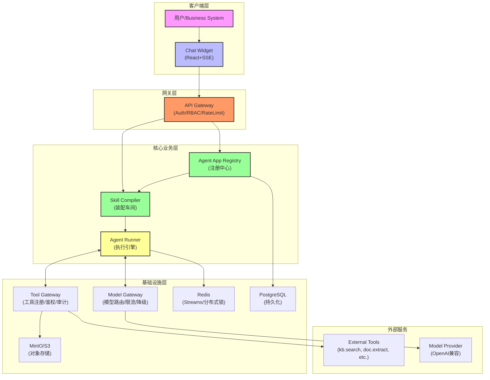

### 1.2 组件关系图

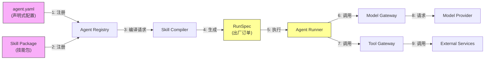

---

## 2. 核心流程图

### 2.1 Agent 创建与部署流程

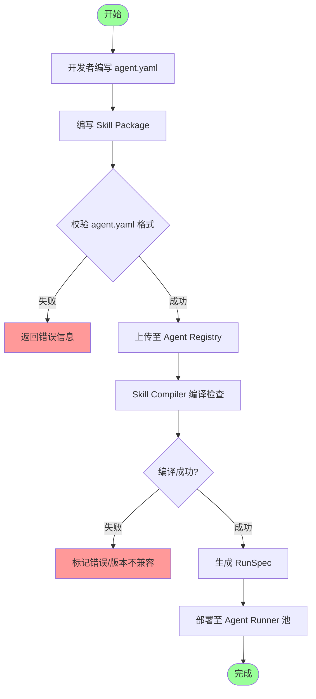

### 2.2 用户请求处理流程

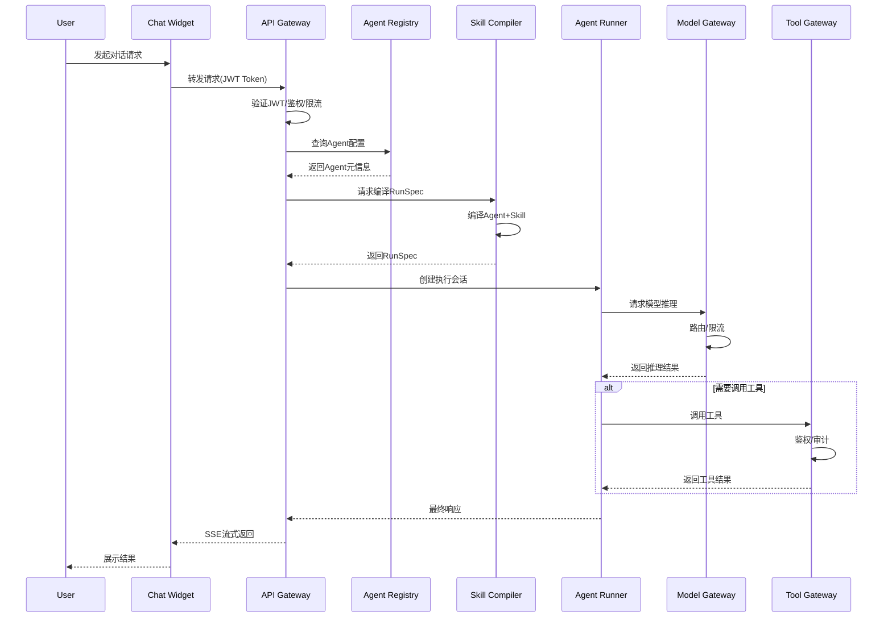

### 2.3 Skill Compiler 编译流程

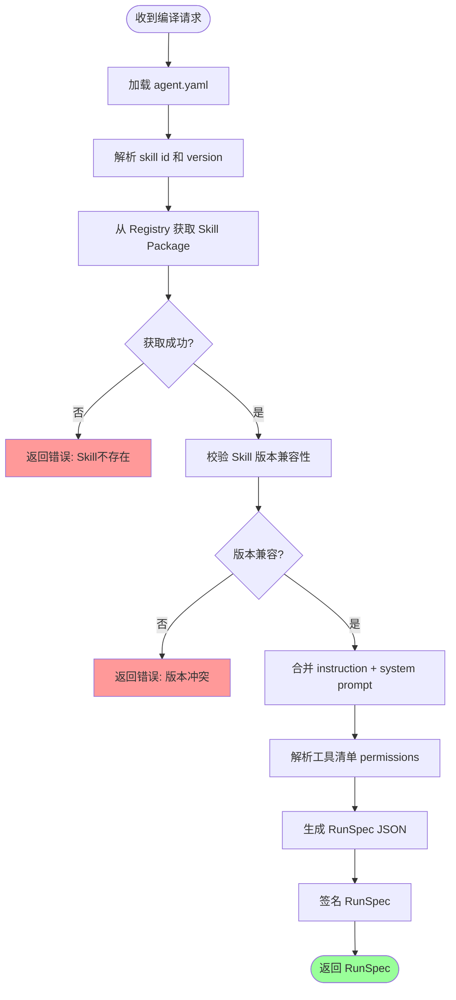

---

## 3. 业务逻辑图

### 3.1 多租户隔离模型

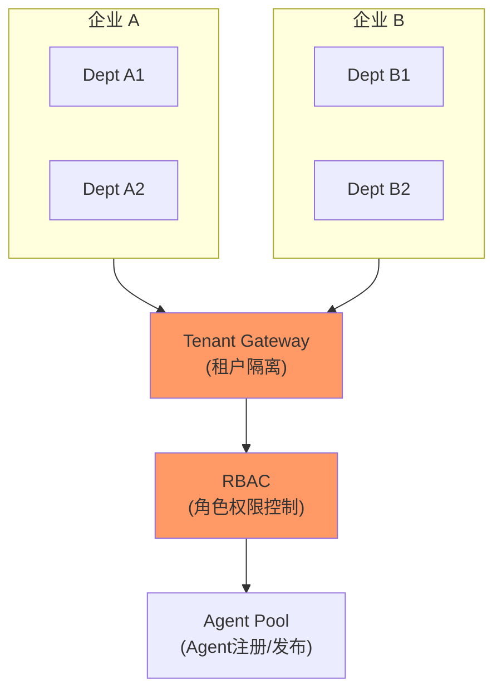

### 3.2 工具调用鉴权流程

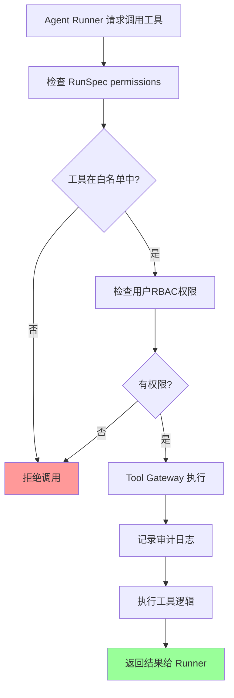

### 3.3 模型路由与降级

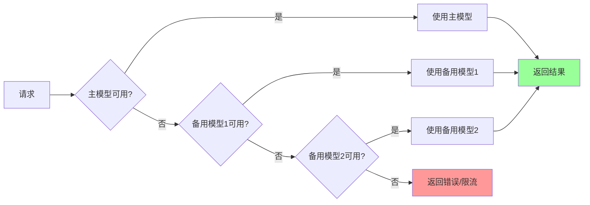

### 3.4 会话与消息存储策略

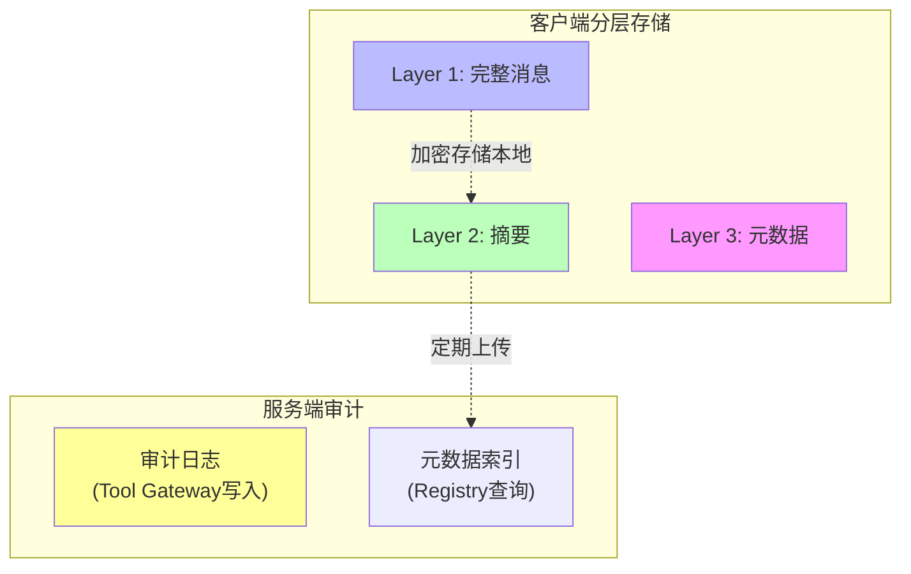

---

## 4. 数据模型关系图

### 4.1 核心实体关系

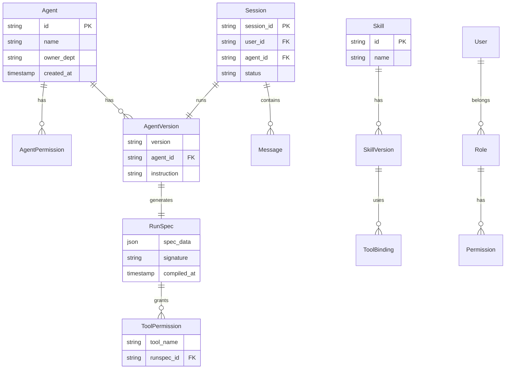

### 4.2 RunSpec 结构

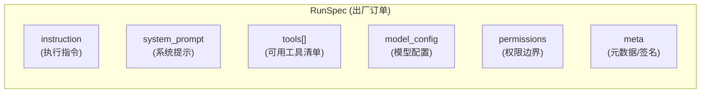

---

## 5. 部署架构图

### 5.1 K8s 部署拓扑

```mermaid
graph TB
    subgraph K8s["Kubernetes Cluster"]
        subgraph Ingress["Ingress"]
            ING["Ingress Controller"]
        end

        subgraph Frontend["Frontend Pods"]
            FE["Chat Widget<br/>(3 replicas)"]
        end

        subgraph Backend["Backend Pods"]
            API["API Server<br/>(5 replicas)"]
            RUN["Agent Runner<br/>(N replicas)"]
            COMP["Skill Compiler<br/>(2 replicas)"]
        end

        subgraph Data["Data Layer"]
            PG["PostgreSQL<br/>(Primary+Replica)"]
            REDIS["Redis Cluster<br/>(3 nodes)"]
            MINIO["MinIO<br/>(Distributed)"]
        end

        subgraph Monitor["Monitoring"]
            PRO["Prometheus"]
            GRAF["Grafana"]
        end
    end

    ING --> FE
    FE --> API
    API --> COMP
    API --> RUN
    RUN --> PG
    RUN --> REDIS
    RUN --> MINIO
    RUN --> ModelExt["External Model API"]
    COMP -.--> PG
    API -.--> PG
    PRO -->|monitor| K8s
    GRAF -->|visualize| PRO

    style K8s fill:#e8e8e8,stroke:#333
    style Data fill:#ffe
```

### 5.2 开发环境架构

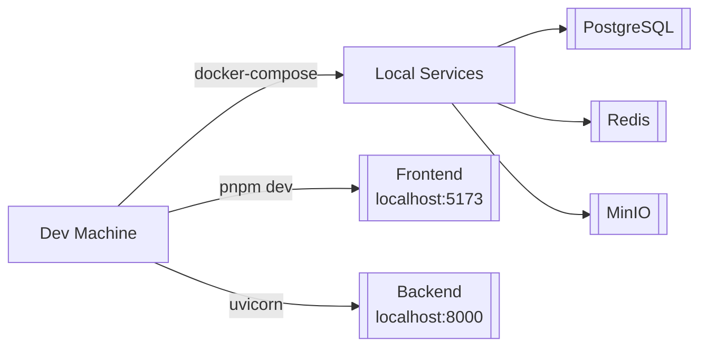

---

## 6. 安全架构图

### 6.1 JWT 认证流程

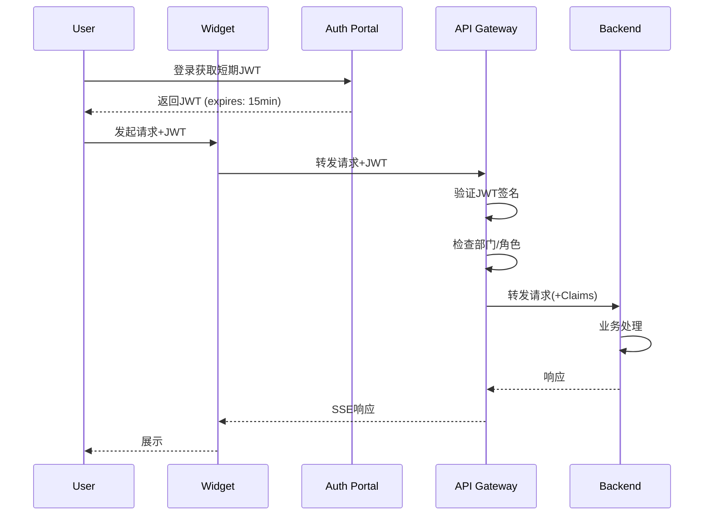

### 6.2 Tool Gateway 安全校验

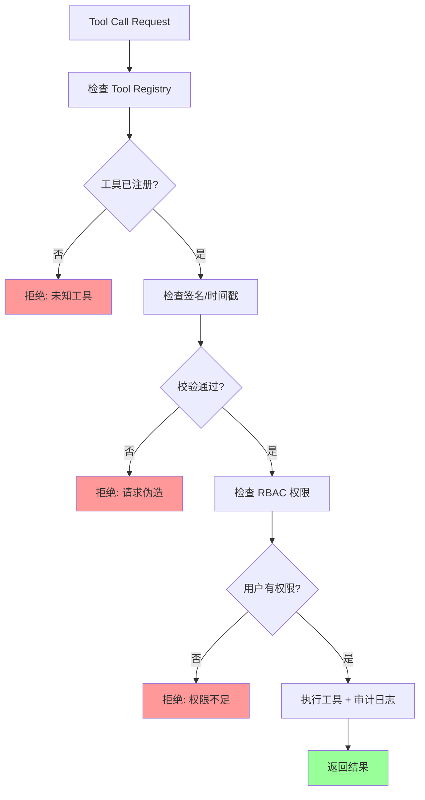

---

## 7. 目录结构图

### 7.1 项目整体结构

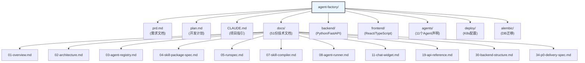

### 7.2 后端目录结构

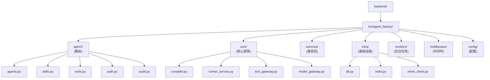

---

## 8. Agent 声明示例

### 8.1 agent.yaml 结构

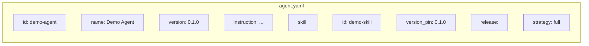

---

## 9. 版本历史

| 版本 | 日期 | 说明 |
|------|------|------|
| 1.0 | 2026-05-11 | 初始文档，包含9个核心图示 |

---

*本文档使用 Mermaid 语法，可直接在 GitHub、GitLab、VS Code 等支持 Mermaid 的平台渲染。*